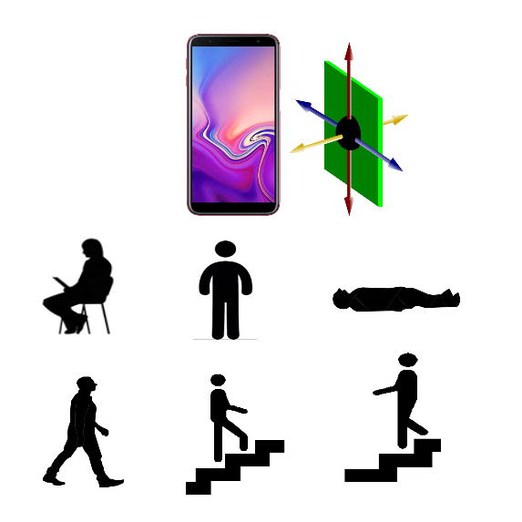

##Introduction

###Background
This project is the capstone project for Introduction to Data Science's Coures from Springboard

###Objectives
The main objective of this project is to explore, visualize, and finally to create machine learning model that is capable to decently classify smartphone users activity based on the smartphones sensors reading data (Accelerometer & Gyroscope).

Human activitiy recognition algorithm is very crucial in mobile application development industry, especially to develop activity based apps such as excercise apps, or even augmented reality based games. 



###About the Dataset
The database used in this project was collected from the accelerometers and gyroscope from the Samsung Galaxy S Smartphone and was obtained from the UCI Machine Learning Repository below:

[Human Activitiy Recognition UCI](https://d396qusza40orc.cloudfront.net/getdata%2Fprojectfiles%2FUCI%20HAR%20Dataset.zip)  

From the readme of this dataset, it is mentioned that the experiments have been carried out with a group of 30 volunteers within an age bracket of 19-48 years. Each person performed six activities (WALKING, WALKING_UPSTAIRS, WALKING_DOWNSTAIRS, SITTING, STANDING, LAYING) wearing a smartphone (Samsung Galaxy S II) on the waist. Using its embedded accelerometer and gyroscope, 3-axial linear acceleration and 3-axial angular velocity at a constant rate of 50Hz were captured. The experiments have been video-recorded to label the data manually. The obtained dataset has been randomly partitioned into two sets, where 70% of the volunteers was selected for generating the training data and 30% the test data. 

The sensor signals (accelerometer and gyroscope) were pre-processed by applying noise filters and then sampled in fixed-width sliding windows of 2.56 sec and 50% overlap (128 readings/window). This means that 1 row of each dataset represents 1.28 sec of measurement.

The most important files from the database that will be used for this project are as the following:

* "activity_labels.txt" - this file was used as reference to label activity numbers' column included in y_train.txt and y_test.txt to their corresponding activity name (STANDING, SITTING, LAYING, WALKING, WALKING DOWNSTAIRS, or WALKING UPSTAIRS)

* "features_info.txt" - This file contains details of about the variables used on the feature vector mentioned in features.txt.

* "features.txt" - This file lists the variable names of the 561 variables. Vectors in this files later will be used to name all columns included in x_test.txt, and x_train.txt.

* "subject_test/train.txt" - This file contains the data for all participants who performed the experiments. 

* "X_test/train.txt" - This file contains data for all engineered data (not the raw data) from smartphone sensors reading. It has all the feature from "features.txt" (561 variables in total) for each participant performing each activity.

* "y_test/train.txt" -This dataset gave assigned number (between 1 and 6) of the activity from which each row of data in the "X-test/train.txt" was derived.

* Inertial Signals" folder that contains the preprocessed data of the actual sensors reading. Inertial signals consist of the following:

  + Gravitational acceleration data files for x, y and z axes: total_acc_x_train.txt, total_acc_y_train.txt, total_acc_z_train.txt.
  
  + Body acceleration data files for x, y and z axes: 
body_acc_x_train.txt, body_acc_y_train.txt, body_acc_z_train.txt.

  + Body gyroscope data files for x, y and z axes: 
body_gyro_x_train.txt,  body_gyro_y_train.txt, body_gyro_z_train.txt.

##Data Wrangling

###Loading the dataset

First step is to load the dataset which is obtained from UCI Machine Learning Repository.

```{r echo=FALSE,warning=FALSE}

library(dplyr)
library(stringr)
library(ggplot2)
library(randomForest)
library(caret)
library(e1071)
library(tictoc)
library(doParallel)
library(pROC)
library(tibble)
library(scales)
library(knitr)
library(kableExtra)
```

```{r}
#Loading the measurement data set
x_train<-read.table("train/X_train.txt")
x_test<-read.table("test/X_test.txt")
#Loading the dataset for activity labels
y_train<-data.frame(ActivityLabel=read.table("train/Y_train.txt"), train.or.test= "train")
y_test<-data.frame(ActivityLabel=read.table("test/Y_test.txt"),train.or.test= "test")
subject_id<- data.frame(Subject=read.table("train/subject_train.txt"))
subject_id_test<- data.frame(Subject=read.table("test/subject_test.txt"))


kable(head(x_train),caption = "X_train Dataset") %>%
  kable_styling(bootstrap_options = c("striped","bordered","hover", "condensed")) %>%
  scroll_box(width = "800px", height = "200px")

str(subject_id)
```

###Adding Features to the Sensor Reading Dataset

Features are loaded from features.txt dataset. Features on this file is not appropiate for features naming, because most the data contains prohibited characters, also some features names are duplicated.
Thus, the next step is to clean up the feature labels from this features.txt, using `gsub()` and `make.names()`.
Function `make.names()` is primarily used to efficiently solve the column names' duplication.

```{r}
#Loading the feature name for each column
label<-read.table("features.txt", col.names=c("id","Name"))

#correct the label dataset, so it can be used to name the measurement data set "x_train"
true_label<-label%>%
            mutate(Feature=make.names(Name,unique=TRUE))%>%
            mutate(Feature=gsub("^f","Frequency.",Feature))%>%
            mutate(Feature=gsub("^t","Time.",Feature))%>%
            mutate(Feature = gsub("^angle", "Angle", Feature)) %>%
            mutate(Feature = gsub("BodyBody", "Body", Feature)) %>%
            mutate(Feature = gsub("Acc", ".Acc", Feature)) %>%
            mutate(Feature = gsub("Gyro", ".Gyro", Feature)) %>%
            mutate(Feature = gsub("Jerk", ".Jerk", Feature)) %>%
            mutate(Feature = gsub("Mag", ".Mag", Feature)) %>%
            mutate(Feature = gsub("\\.{2,}", ".", Feature)) %>%
            mutate(Feature = gsub("\\.+$", "", Feature)) %>%
            select(Feature)%>%
            unlist()


#Add name to the measurement data set
x_train<-setNames(x_train,true_label)
x_test<-setNames(x_test,true_label)
#combine x_train and x_test
human.activity<- rbind(x_train,x_test)
rm(x_train,x_test,true_label,label)

kable(head(human.activity),caption = "X_train & X_test Combined") %>%
  kable_styling(bootstrap_options = c("striped","bordered", "hover", "condensed")) %>%
  scroll_box(width = "800px", height = "200px")
```

###Adding Actitivity Label from y dataset

To make it more understandable, activity label, which consists of numbering of each activity, will be converted to actual activities correspond to each numbering. 

```{r}
#Converting the activity label to activity name
y_all<-rbind(y_train,y_test)
rm(y_test,y_train)
y_all<-setNames(y_all,c("ActivityLabel","Train.or.Test"))
                  
y_all<-y_all %>% mutate(ActivityName=case_when(ActivityLabel==1~"WALKING",
                                          ActivityLabel==2~"WALKING_UPSTAIRS",
                                          ActivityLabel==3~"WALKING_DOWNSTAIRS",
                                          ActivityLabel==4~"SITTING",
                                          ActivityLabel==5~"STANDING",
                                          ActivityLabel==6~"LAYING"))


y_all$ActivityName<- as.factor(y_all$ActivityName)

kable(head(y_all),caption = "Y_train and Y_test Combined") %>%
  kable_styling(bootstrap_options = c("striped","bordered", "hover", "condensed")) %>%
  scroll_box(width = "800px", height = "200px")
```                   

###Combining All Dataset Together

Next step is to combine all of the datasets above to human.activity dataset.
Furthermore, indices will also be added for data exploratory and visualization purpose.
These new features basically serve as time stamp for data visualization that will be done later.
The indices' features consist of the following:

* Overall.ID - time stamp for all observations, which start from no 1 to the end of row numbers' observation.

* Activity.ID - time stamp that is unique for each activity.

* Subject.ID - time stamp that is unique for each subject.

* Subject.Activity.ID - time stamp that is unique for each activity within each subject.

```{r}

#combining subject markes of both train and test data
subject_id<- rbind(subject_id,subject_id_test)
subject_id<- setNames(subject_id,"Subject")

#Combining both measurement data set to its activity label dataset
human.activity<-cbind(subject_id,y_all,human.activity)
human.activity<-human.activity%>%
                mutate(Overall.ID=as.numeric(row_number()))

human.activity <- human.activity %>% 
                  group_by(ActivityName) %>% 
                  mutate(Activity.ID=row_number()) 
human.activity <- human.activity %>% 
                  group_by(Subject) %>%
                  mutate(Subject.ID=row_number())
human.activity <- human.activity %>%
                  group_by(Subject,ActivityName)%>% 
                  mutate(Subject.Activity.ID=row_number())%>%
                  select(Overall.ID,Subject.ID,Activity.ID,Subject.Activity.ID,Train.or.Test,everything())

kable(head(human.activity),caption = "Tidy Data for Data Visualization") %>%
  kable_styling(bootstrap_options = c("striped","bordered","hover", "condensed")) %>%
  scroll_box(width = "800px", height = "200px")
```

##Understanding The Data

From the Readme file of this dataset, the author has mentioned that in the engineered data set that we will use as predictors (x_test/train.txt) : "Features are normalized and bounded within [-1,1].". This means that "Time.Mean.Acc.Mean.X" is not simply the mean of each row of the raw sensor reading dataset from "body_acc_x_train.txt". Instead, it is obtained by first averaging value of each row in "body_acc_x_train.txt", then normalizing the mean value of each row using Min Max normalization: 

$normalized\,x= \frac{x-max_{all\,x}}{max_{all\,x}-min_{x}}(new\,max_{all\,x}-new\,min_{all\,x})+new\,min_{all\,x}$

Please note that the normalization only done within each dataset (either train dataset or test), not between different datasets. In the otherwords, value from training dataset (e.g.: mean value of 1 row of accelerator reading) is only normalized or rescaled with respect to the other mean values of training dataset, and not with respect to both training and test dataset simultaneously.

To proof this, we will calculate the mean and standard deviation of each row of body_acc_x_train.txt, normalize the result using above equation, and then try to compare it with the data "Time.Mean.Acc.Mean.X" and "Time.Mean.Acc.std.X" from "x_train.txt"  

```{r}
#load the raw inertia dataset
raw.acc.x.train <-  read.table("train/Inertial Signals/body_acc_x_train.txt")

#creating the min max normalize function
normalize <- function(x,newmin,newmax) {
    return (((x - min(x)) / (max(x) - min(x))*(newmax-newmin))+newmin)
  }

#to find the normalized mean and std of each row of the raw datset
raw.acc.x.train.sum<- raw.acc.x.train%>%
                      mutate(mean.raw=apply(.,1,mean),std.raw=apply(.,1,sd))%>%
                      select(mean.raw,std.raw)

raw.acc.x.train.sum=data.frame(apply(raw.acc.x.train.sum,2,normalize,newmin=-1,newmax=1))

#Comparing the dataset that has been engineered by the author (x_train) with normalized mean and standard deviation, which have been manually calculated above.

human.activity%>%ungroup()%>%
                 filter(Train.or.Test=="train")%>%
                 select(Time.Body.Acc.mean.X, Time.Body.Acc.std.X)%>%
                 cbind(raw.acc.x.train.sum)%>%
                 select(Time.Body.Acc.mean.X,mean.raw,Time.Body.Acc.std.X,std.raw)%>%
                 summary()
```

From the summary() result above, we can clearly see that that the normalized mean and standard deviation values that we calculated manually are identical with the "Time.Body.Acc.mean.x"  and "Time.Body.Acc.std.x" respectively.

With this we can now understand that the values included in x_test is not the actual value. Instead it can be intrepreted as follow:

* -1 means that the value is equal to the minimum value of all obseravtions in the same feature.

* +1 means that the value is equal to the maximum value of all observations in the same feature.

* 0 means that the value is approximately equal to the median value.

This is very useful during data exploratory, because we will be able to understand how exactly each observation/group compared to others.

##Data Exploratory and Visualization

###Distribution of Activities

The distrubtion for all activities across all subjects are shown below:
```{r}
#to see the distribution of all activities
ggplot(human.activity, aes(x=ActivityName,fill=ActivityName))+
  geom_bar()+
  theme_bw()+
  theme(legend.position = "none", axis.text.x=element_text(angle=45,hjust=1))+
  labs(title="Distribution of Activities")

#to see the distribution of all activities done by each subject      
ggplot(human.activity, aes(x=Subject,fill=ActivityName))+
  geom_bar()+
  theme_bw()+
  theme(legend.position = "none", axis.text.x=element_text(angle=45,hjust=1))+
  labs(title="Distribution of Activities")
```

As shown above the distribution of activities is not equal. 
Therefore, the following dataset will be created, which are useful to equalize the number of observations of each activity. This will be useful for the data visualizations later.

```{r}
minmax.activity<-human.activity%>%
                 group_by(ActivityName)%>%
                 summarize(max.activity=max(Activity.ID))

minmax.subject.activity <-human.activity%>%
                         group_by(Subject, ActivityName)%>%
                         summarize(max.activity=max(Subject.Activity.ID))

kable(head(minmax.activity),caption = "Activity Duration (Time Index) Across All Subjects") %>%
  kable_styling(bootstrap_options = c("striped","bordered","hover", "condensed")) %>%
  scroll_box(width = "800px", height = "200px")

kable(head(minmax.subject.activity),caption = "Activity Duration (Time Index) per Subject") %>%
  kable_styling(bootstrap_options = c("striped","bordered","hover", "condensed")) %>%
  scroll_box(width = "800px", height = "200px")
```

###Order of Experiment

In what order the experiment was performed in term of subjects are shown below: 

```{r}
#to see in what order the experiment was performed in term of subject
human.activity%>% filter(Train.or.Test=="train")%>%
  ggplot(aes(x=Overall.ID, y=Subject))+
  geom_line(size=1.5,color="blue")+
  xlab("Index")+
  ylab("Subject")+
  theme_bw() +
  labs(title="Order of Subject During Experiment")
```

As shown above, no repetition in term of subjects' order. The dataset has been ordered by subject from the beginning.

Next, is to show the order of activiy done by each subject.
```{r}
#to see in what order the experiment was performed in term of activity
ggplot(human.activity, aes(x=Subject.ID, y=ActivityLabel, col=ActivityLabel))+
  geom_line(size=1)+
  scale_color_gradientn(colours = rainbow(5),breaks=c(1,2,3,4,5,6),labels=c("1. Walking","2. Walking Upstairs","3 Walking Downstairs","4.Sitting","5.Standing","6.Laying"))+
  facet_wrap(Subject~.,ncol=6)+
  xlab("Index")+
  ylab("Activity Label")+
  theme_bw() +
  theme(axis.text.x = element_blank(),axis.ticks.x=element_blank())+
  labs(title="Order of Activity done by each Subject during Experiment")
```

As shown above, all subjects done the same order of activities. To see it clearly we will see the activities done by only 4 subjects (subject no =1,2,3,4)

```{r}
human.activity%>%filter(Subject<=4)%>%
  ggplot(aes(x=Subject.ID, y=ActivityLabel, col=ActivityLabel))+
  geom_line(size=1)+
  scale_color_gradientn(colours = rainbow(5),breaks=c(1,2,3,4,5,6),labels=c("1. Walking","2.Walking Upstairs","3   Walking Downstairs","4.Sitting","5.Standing","6.Laying"))+
  facet_wrap(Subject~.,ncol=2)+
  xlab("Index")+
  ylab("Activity Label")+
  theme_bw() +
  theme(axis.text.x = element_blank(),axis.ticks.x=element_blank())+
  scale_y_continuous(breaks=seq(0,6,1))+
  labs(title="Order of Activity done by each Subject during Experiment")
```

From above visualization, we can see that each subject performed the experiment in the following order :

Standing -> Sitting -> Laying -> Walking -> Walking Downstairs -> Walking Upstairs


###Time Series Visualization for One Subject

Next step is to show the time series visualization of mean, standard deviation, and magnitude of Body Acceleration, Body Gyroscope, and Body Gravity Reading.

First is to determine the minimum time index across all activities done by subject 5. 
```{r}
Subjects <- minmax.subject.activity%>%
                   filter(Subject==5)
Subjects.length<- min(Subjects$max.activity)
paste("Minimum duration of activity done by Subject 5 is",Subjects.length,"indices or equal to ", Subjects.length*1.28, "second(s)")
```

####Time Series Plot of Body Acceleration

```{r}
#Body Accelration Reading Mean of subject no 5
human.activity%>%filter(Subject==5,Subject.Activity.ID<=Subjects.length)%>%
  ggplot(aes(x=Subject.Activity.ID))+
  geom_line(aes(y=Time.Body.Acc.mean.X),color="red")+
  geom_line(aes(y=Time.Body.Acc.mean.Y),color="blue")+
  geom_line(aes(y=Time.Body.Acc.mean.Z),color="green")+
  facet_grid(ActivityName~.)+
  xlab("Time Index")+
  ylab("Normalized Mean of Acceleration")+
  theme_bw() +
  theme(strip.text = element_text(size = 4.5))+
  labs(title="Mean of Body Acceleration Plot of Subject 5")
```

From the result of Mean of Accelleration reading we can observe that stationary activities (laying, sitting, and standing) shows less variation if compared to moving activities (walking, walking downstairs, walking upstairs) 

```{r}
#Body Accelration Reading SD of subject no 5
human.activity%>%filter(Subject==5,Subject.Activity.ID<=Subjects.length)%>%
  ggplot(aes(x=Subject.Activity.ID))+
  geom_line(aes(y=Time.Body.Acc.std.X),color="red")+
  geom_line(aes(y=Time.Body.Acc.std.Y),color="blue")+
  geom_line(aes(y=Time.Body.Acc.std.Z),color="green")+
  facet_grid(ActivityName~.)+
  xlab("Time Index")+
  ylab("Normalized Standard Deviation of Acceleration")+
  theme_bw() +
  theme(strip.text = element_text(size = 4.5))+
  labs(title="Standard Deviation of Body Acceleration Plot of Subject 5")
```

From the result of Standard Deviation of Accelleration Time series above, it shows that standard deviation of stationary activities are relatively at the minimum value if compared to the other observations. Because actual standard deviation cannot be less than 0, so we can safely assume that the standard deviation of these stationary activities is approximately equal to 0.

Moving activities, as expected, shows relatively high standard deviation if compared to the stationary activities. 
From this result also we can see there is differece in value between walking downstairs and upstairs.
Walking downstairs plots show that it has relatively lower Y axis reading if compared to walking upstairs.


```{r}
#Body Acceleration Magnitude of subject
human.activity%>%filter(Subject==5,Subject.Activity.ID<=Subjects.length)%>%
  ggplot(aes(x=Subject.Activity.ID))+
  geom_line(aes(y=Time.Body.Acc.Mag.mean),color="purple")+
  facet_grid(ActivityName~.)+
  xlab("Index")+
  ylab("Normalized Magnitude of Acceleration")+
  theme_bw() +
  theme(strip.text = element_text(size = 4.5))+
  labs(title="Magnitude (Resultant of X,Y,Z) of Body Acceleration Plot of Subject 5")
```

We can also draw same conclusion from the Magnitude (Resultant of X,Y,Z) of Body Acceleration above. The new discovery is regarding the normal walking that shows relatively lower value if compared to walking upstairs/downstairs. Also, the walking upstairs shows relatively slightly higher magnitude value if compared with walking downstairs.


####Time Series Plot of Body Gyroscope reading

Next step is to show the time series visualization of Gyroscope reading only for Subject 5:

```{r}

#Body Gyroscope Reading Mean of subject no 5
human.activity%>%filter(Subject==5,Subject.Activity.ID<=Subjects.length)%>%
  ggplot(aes(x=Subject.Activity.ID))+
  geom_line(aes(y=Time.Body.Gyro.mean.X),color="red")+
  geom_line(aes(y=Time.Body.Gyro.mean.Y),color="blue")+
  geom_line(aes(y=Time.Body.Gyro.mean.Z),color="green")+
  facet_grid(ActivityName~.)+
  xlab("Time Index")+
  ylab("Normalized Mean of Gyroscope")+
  theme_bw() +
  theme(strip.text = element_text(size = 4.5))+
  labs(title="Mean of Body Gyroscope Plot of Subject 5")
```

Gyroscope which represents the radial velocity of subject shows that laying has relatively higher Z axis value if compared to the other stationary activities. 
Meanwhile, normal walking shows that it shows barely no variation in gyroscope reading if compared to the walking upstairs/downstairs.


```{r}
#Body Gyroscope Reading SD of subject no 5
human.activity%>%filter(Subject==5,Subject.Activity.ID<=Subjects.length)%>%
  ggplot(aes(x=Subject.Activity.ID))+
  geom_line(aes(y=Time.Body.Gyro.std.X),color="red")+
  geom_line(aes(y=Time.Body.Gyro.std.Y),color="blue")+
  geom_line(aes(y=Time.Body.Gyro.std.Z),color="green")+
  facet_grid(ActivityName~.)+
  xlab("Time Index")+
  ylab("Normalized Standard Deviation of Gyroscope")+
  theme_bw() +
  theme(strip.text = element_text(size = 4.5))+
  labs(title="Standard Deviation of Body Gyroscope Plot of Subject 5")
```

We can draw the same conclusion from the Standard Deviation of Gyroscope with the Body Acceleration's counterpart.

```{r}
#Body Gyroscope Magnitude of subject
human.activity%>%filter(Subject==5,Subject.Activity.ID<=Subjects.length)%>%
  ggplot(aes(x=Subject.Activity.ID))+
  geom_line(aes(y=Time.Body.Gyro.Mag.mean),color="purple")+
  facet_grid(ActivityName~.)+
  xlab("Time Index")+
  ylab("Normalized Magnitude of Gyroscope")+
  theme_bw() +
  theme(strip.text = element_text(size = 4.5))+
  labs(title="Magnitude (Resultant of X,Y,Z) of Body Gyroscope Plot of Subject 5")
```

Likewise, We can draw the same conclusion from the Maginitude of Gyroscope with the Body Acceleration's counterpart.

####Time Series Plot of Gravity Result

Next step is to show the time series visualization of Gravity reading only for Subject 5:

```{r}
#Body Gravity Reading Mean of subject no 5
human.activity%>%filter(Subject==5,Subject.Activity.ID<=Subjects.length)%>%
  ggplot(aes(x=Subject.Activity.ID))+
  geom_line(aes(y=Time.Gravity.Acc.mean.X),color="red")+
  geom_line(aes(y=Time.Gravity.Acc.mean.Y),color="blue")+
  geom_line(aes(y=Time.Gravity.Acc.mean.Z),color="green")+
  facet_grid(ActivityName~.)+
  xlab("Time Index")+
  ylab("Normalized Mean of Gravity")+
  theme_bw() +
  theme(strip.text = element_text(size = 4.5))+
  labs(title="Mean of Body Gravity Plot of Subject 5")
```

The most significant discoveries that we can condlude from above data is that laying has relatively lower x axis graivity reading value compared to other stationary activities. Also the Walking Upstairs y axis value is slightly lower than other moving activities

```{r}
#Body Gravity Reading SD of subject no 5
human.activity%>%filter(Subject==5,Subject.Activity.ID<=Subjects.length)%>%
  ggplot(aes(x=Subject.Activity.ID))+
  geom_line(aes(y=Time.Gravity.Acc.std.X),color="red")+
  geom_line(aes(y=Time.Gravity.Acc.std.Y),color="blue")+
  geom_line(aes(y=Time.Gravity.Acc.std.Z),color="green")+
  facet_grid(ActivityName~.)+
  xlab("Time Index")+
  ylab("Normalized Standard Deviation of Gravity")+
  theme_bw() +
  theme(strip.text = element_text(size = 4.5))+
  labs(title="Standard Deviation of Body Gravity Plot of Subject 5")
```

From above plot, it is quite difficult to draw any conclusion regarding the standard deviation for gravity value. We will try to revisit this variable during the histogram plotting.

```{r}
#Body Gravity Magnitude of subject
human.activity%>%filter(Subject==5,Subject.Activity.ID<=Subjects.length)%>%
  ggplot(aes(x=Subject.Activity.ID))+
  geom_line(aes(y=Time.Gravity.Acc.Mag.mean),color="purple")+
  facet_grid(ActivityName~.)+
  xlab("Time Index")+
  ylab("Normalized Gravity Magnitude Value")+
  theme_bw() +
  theme(strip.text = element_text(size = 4.5))+
  labs(title="Magnitude (Resultant of X,Y,Z) of Body Gravity Plot of Subject 5")
```

From above plot, we can observe subtle yet quite obvious difference between moving activites with the value of resultant of gravity of x-y-z axis from higher to lower being as follows: Walking Downstairs, Walking Upstairs, Walking.


###Histogram Visualization for All Subjects

To understand the data further, next step is to show the histogram of Accelerator, Gyroscope, and Gravity Reading across all subjects.

####Histogram of Body Acceleration Data across all Subjects

```{r}
#Histogram Body Acceleration Mean of All Subjects
human.activity%>%filter(Activity.ID<=min(minmax.activity$max.activity))%>%
  ggplot()+
  geom_histogram(binwidth=0.05,aes(x=Time.Body.Acc.mean.X),fill="red", alpha=0.6)+
  geom_histogram(binwidth=0.05,aes(x=Time.Body.Acc.mean.Y),fill="blue",alpha=0.6)+
  geom_histogram(binwidth=0.05,aes(x=Time.Body.Acc.mean.Z),fill="green",alpha=0.6)+
  facet_grid(ActivityName~.)+
  theme_bw() +
  theme(strip.text = element_text(size = 4.5))+
  xlab("Normalized Acceleration Value")+
  ylab("Count")+
  labs(title="Mean of Body Acceleration Reading Plot")
```

From the result of Mean of Accelleration reading we can observe that stationary activities (laying, sitting, and standing) shows concentration in negatives value if compared to moving counterparts which shows more equally distributed reading accross all values.

```{r}
#Histogram Body Acceleration Standard Deviation of All Subjects
human.activity%>%filter(Activity.ID<=min(minmax.activity$max.activity))%>%
  ggplot()+
  geom_histogram(binwidth=0.05,aes(x=Time.Body.Acc.std.X),fill="red", alpha=0.6)+
  geom_histogram(binwidth=0.05,aes(x=Time.Body.Acc.std.Y),fill="blue",alpha=0.6)+
  geom_histogram(binwidth=0.05,aes(x=Time.Body.Acc.std.Z),fill="green",alpha=0.6)+
  facet_grid(ActivityName~.)+
  theme_bw() +
  theme(strip.text = element_text(size = 4.5))+
  xlab("Normalized Acceleration Value")+
  ylab("Count")+
  labs(title="Standard Deviation of Body Acceleration Reading Plot")
```

From the result of Standard Deviation of Accelleration's histogram above, it has become more apparent that the stationary activities standard deviations all concentrated in the lowest end (-1), while the moving activities lay at the middle to the high end and more distributed equally. 

```{r}
#Histogram Body Acceleration Magnitude of All Subjects
human.activity%>%filter(Activity.ID<=min(minmax.activity$max.activity))%>%
  ggplot()+
  geom_histogram(binwidth=0.05,aes(x=Time.Body.Acc.Mag.mean),fill="purple", alpha=0.6)+
  facet_grid(ActivityName~.)+
  theme_bw() +
  theme(strip.text = element_text(size = 4.5))+
  xlab("Normalized Acceleration Value")+
  ylab("Count")+
  labs(title="Magnitued (Resultant x-y-z) of Body Acceleration Reading Plot")
```

Same conclusion can also be drawn from histogram of magnitude above with the stationary activities are more concentrated at the lower end if compared to the moving activities. Furthermore the walking downstairs' magnitude value is slightly higher than walking and walking upstairs.


####Histogram of Body Gyroscope Data across all Subjects


```{r}
#Histogram Body Gyroscope Mean of All Subjects
human.activity%>%filter(Activity.ID<=min(minmax.activity$max.activity))%>%
  ggplot()+
  geom_histogram(binwidth=0.05,aes(x=Time.Body.Gyro.mean.X),fill="red", alpha=0.6)+
  geom_histogram(binwidth=0.05,aes(x=Time.Body.Gyro.mean.Y),fill="blue",alpha=0.6)+
  geom_histogram(binwidth=0.05,aes(x=Time.Body.Gyro.mean.Z),fill="green",alpha=0.6)+
  facet_grid(ActivityName~.)+
  theme_bw() +
  theme(strip.text = element_text(size = 4.5))+
  xlab("Normalized Gyroscope Value")+
  ylab("Count")+
  labs(title="Mean of Body Gyroscope Reading Plot")
```

From the result of Mean of Gyroscope reading we can observe that stationary activities (laying, sitting, and standing) shows concentration in one specific value if compared to moving counterparts which shows more equally distributed reading accross all values. 

```{r}
#Histogram Body Gyroscope Standard Deviation of All Subjects
human.activity%>%filter(Activity.ID<=min(minmax.activity$max.activity))%>%
  ggplot()+
  geom_histogram(binwidth=0.05,aes(x=Time.Body.Gyro.std.X),fill="red", alpha=0.6)+
  geom_histogram(binwidth=0.05,aes(x=Time.Body.Gyro.std.Y),fill="blue",alpha=0.6)+
  geom_histogram(binwidth=0.05,aes(x=Time.Body.Gyro.std.Z),fill="green",alpha=0.6)+
  facet_grid(ActivityName~.)+
  theme_bw() +
  theme(strip.text = element_text(size = 4.5))+
  xlab("Normalized Gyroscope Value")+
  ylab("Count")+
  labs(title="Standard Deviation of Body Gyroscope Reading Plot")
```

Above histogram resulted the same conclusion if compared to the standard deviation body acceleration above.

```{r}
#Histogram Body Gyroscope Standard Deviation of All Subjects
human.activity%>%filter(Activity.ID<=min(minmax.activity$max.activity))%>%
  ggplot()+
  geom_histogram(binwidth=0.05,aes(x=Time.Body.Gyro.Mag.mean),fill="red", alpha=0.6)+
  facet_grid(ActivityName~.)+
  theme_bw() +
  theme(strip.text = element_text(size = 4.5))+
  xlab("Normalized Gyroscope Value")+
  ylab("Count")+
  labs(title="Magnitude(Resultant x-y-z) of Body Gyroscope Reading Plot")
```

Above histogram resulted the same conclusion if compared to the standard deviation body acceleration above.

####Histogram of Body Gravity Data across all Subjects

```{r}
#Histogram Body Gravity Mean of All Subjects
human.activity%>%filter(Activity.ID<=min(minmax.activity$max.activity))%>%
  ggplot()+
  geom_histogram(binwidth=0.05,aes(x=Time.Gravity.Acc.mean.X),fill="red", alpha=0.6)+
  geom_histogram(binwidth=0.05,aes(x=Time.Gravity.Acc.mean.Y),fill="blue",alpha=0.6)+
  geom_histogram(binwidth=0.05,aes(x=Time.Gravity.Acc.mean.Z),fill="green",alpha=0.6)+
  facet_grid(ActivityName~.)+
  theme_bw() +
  theme(strip.text = element_text(size = 4.5))+
  xlab("Normalized Gravity Value")+
  ylab("Count")+
  labs(title="Mean of Body Gravity Reading Plot")
```

Gravity reading for laying is more distributed equally across all range, if compared to other reading. Also other activities have higher x value if compared to laying. 

```{r}
#Histogram Body Gravity Standard deviation of All Subjects
human.activity%>%filter(Activity.ID<=min(minmax.activity$max.activity))%>%
  ggplot()+
  geom_histogram(binwidth=0.05,aes(x=Time.Gravity.Acc.std.X),fill="red", alpha=0.6)+
  geom_histogram(binwidth=0.05,aes(x=Time.Gravity.Acc.std.Y),fill="blue",alpha=0.6)+
  geom_histogram(binwidth=0.05,aes(x=Time.Gravity.Acc.std.Z),fill="green",alpha=0.6)+
  facet_grid(ActivityName~.)+
  theme_bw() +
  theme(strip.text = element_text(size = 4.5))+
  xlab("Normalized Gravity Value")+
  ylab("Count")+
  labs(title="Standard Deviation of Body Gravity Reading Plot")
```

Stationary activities show slightly lower value than moving activities. Also, walking x,y values are slightly lower if compared to walking down/upstairs activity.

##Making the Prediction Model

###Preparation
Before we start creating the machine learning model, first we will split the dataset back into train, and test data set. Also we will also remove unnecesary features such as ID, Subject name etc.

```{r}
#Splitting the dataset into train and test
human.activity.train<- human.activity %>%
                       ungroup()%>%
                       filter(Train.or.Test=="train")%>%
                       select(-Overall.ID,-Subject.ID,-Activity.ID,-Subject.Activity.ID,
                              -Train.or.Test,-Subject,-ActivityLabel)

human.activity.test<- human.activity %>%
                       ungroup()%>%
                       filter(Train.or.Test=="test")%>%
                       select(-Overall.ID,-Subject.ID,-Activity.ID,-Subject.Activity.ID,
                              -Train.or.Test,-Subject,-ActivityLabel)

kable(head(human.activity.train),caption="Tidy Dataset Only for Training") %>%
  kable_styling(bootstrap_options = c("striped","bordered","hover", "condensed")) %>%
  scroll_box(width = "800px", height = "200px")

```

###Prediction Model using Random Forest

####Creating and Evaluating the Accuracy of the Model
We will  create classification model using the random forest, then to confirm the accuracy using confusion matrix.
Hyperparameters we will set the hyperparameters as follows:

* Number of variables randomly sampled as candidates at each split (mtry)=24

* Number of trees to grow (ntree)=500

Above parameters were obtained as a result of tuning using caret package.

```{r}

set.seed(123)  # for reproducibility
model1 <- randomForest(formula = ActivityName ~ ., 
                       data = human.activity.train,
                       ntree=500,
                       mtry=24, importance=TRUE)
```

```{r}
class_prediction <- predict(object = model1,   # model object 
                            newdata = human.activity.test,  # test dataset
                            type = "class") # return classification labels
                            

# Calculate the confusion matrix for the test set
cm <- confusionMatrix(data = class_prediction,       # predicted classes
                      reference = human.activity.test$ActivityName)  # actual classes
print(cm)
```

From the above, with the model above, we can predict the activity of the smartphone user with the accuracy of `r percent(cm$overall["Accuracy"])`, and the Kappa value of `r percent(cm$overall["Kappa"])`. The accuracy states how well the model predicted accurately for each activity. The kappa shares the same information but it calculates how well a model predicted while taking into account chance or luck. Both of the values of accuracy and kappa obtained by above model are cosidered quite high.

####ROC and AUC of the Model
Next, we will plot the reciever operating characteristic (ROC), and inspect area under the curve (AUC) for each class to tell how much model is capable of distinguishing between classes. Because we are dealing with multiclass classification problems, instead of simple binary "Yes" or "NO" classification problem, we need to perform the following steps in order to plot ROC & to obtain the AUC:

1. Making new dataset of the prediction for each class, but in a form of matrix of probabilities (range from 0-1), instead of classification labels. This can be achieved by using `predict(,type="prob")`
2. Adding new variable/feature "predict", which indicates the prediction of activity label to the new dataset mentioned in no.1. Label is determined based on the activity with the highest probability.
3. Adding new variable/feature "obs", which consists of observable or actual activity labels. This new variable is obtained from the ActivityName of human.activity.test dataset `human.activity.test$ActivityName`.
4. To create ROC plot for each activity class separately.
5. To combine above ROC plot into one.
6. Finally, is to determine the AUC.

```{r}
#Prediction of probablities of each class
class_prediction_prob <- as.data.frame(predict(object = model1,   # model object 
                            newdata = human.activity.test,  # test dataset
                            type = "prob"))# return probability of each class

#Adding predicted label
class_prediction_prob$predict<- names(class_prediction_prob)[1:6][apply(class_prediction_prob[,1:6], 1,which.max)]
#Adding observed/measured label
class_prediction_prob$obs<- human.activity.test$ActivityName

#Creating ROC for each class.
roc.plot1 <- roc(ifelse(class_prediction_prob$obs=="STANDING", 1, 0), 
                 as.numeric(class_prediction_prob$STANDING))
roc.plot2 <- roc(ifelse(class_prediction_prob$obs=="SITTING", 1, 0), 
                 as.numeric(class_prediction_prob$SITTING))
roc.plot3 <- roc(ifelse(class_prediction_prob$obs=="LAYING", 1, 0), 
                 as.numeric(class_prediction_prob$LAYING))
roc.plot4 <- roc(ifelse(class_prediction_prob$obs=="WALKING", 1, 0), 
                 as.numeric(class_prediction_prob$WALKING))
roc.plot5 <- roc(ifelse(class_prediction_prob$obs=="WALKING_UPSTAIRS", 1, 0), 
                 as.numeric(class_prediction_prob$WALKING_UPSTAIRS))
roc.plot6 <- roc(ifelse(class_prediction_prob$obs=="WALKING_DOWNSTAIRS", 1, 0), 
                 as.numeric(class_prediction_prob$WALKING_DOWNSTAIRS))

#Combining all ROC into one plot.
ggroc(list(STANDING = roc.plot1, 
           SITTING = roc.plot2,
           LAYING = roc.plot3,
           WALKING = roc.plot4,
           WALKING_UPSTAIRS = roc.plot5,
           WALKING_DOWNSTAIRS = roc.plot6))+
           facet_wrap(.~name)+
           theme_bw()

#Calculating the AUC
AUC<- data.frame(Activity=c("STANDING","SITTING","LAYING","WALKING",
                            "WALKING_UPSTAIRS","WALKING_DOWNSTAIRS"),
                 AUC=c(round((auc(roc.plot1)),3),round((auc(roc.plot2)),3),
                       round((auc(roc.plot3)),3),
                       round((auc(roc.plot4)),3),round((auc(roc.plot5)),3),
                       round((auc(roc.plot6)),3)))
kable(AUC,caption="Area Under the Curve (AUC)") %>%
  kable_styling(bootstrap_options = c("striped","bordered","hover", "condensed")) %>%
  scroll_box(width = "800px", height = "200px")
```

From the above, the model has resulted in a very high value of AUC (very close to 1). This means that our model is very capable in distinguishing or classifying between classes of activities.

####Parameters Importance

We will find which features are the most impactful among all 561 features that we have in the dataset. Importance of features are measured using Mean of Decrease in Accuracy. The more the accuracy of the random forest decreases due to the exclusion (or permutation) of a single variable, the more important that variable is deemed, and therefore variables with a large mean decrease in accuracy are more important for classification of the data.

First, is to determine the top 10 the most important features/variables.

```{r}
rf.importance<-data.frame(importance(model1,type=1))
rf.importance<-rf.importance%>%
               rownames_to_column("Features")


rf.importance.top5<-rf.importance%>%  top_n(n=10, wt=MeanDecreaseAccuracy)%>%
                                      mutate(Features=factor(Features,
                                                           levels=Features[order(MeanDecreaseAccuracy)]))%>%
                                      ggplot(aes(x=Features,y=MeanDecreaseAccuracy,fill=Features))+
                                      geom_bar(stat="identity")+
                                      theme_bw()+
                                      coord_flip()+
                                      ylab("Mean Decrease in Accuracy(%)")+
                                      xlab("Features")+
                                      theme(legend.title = element_blank())+
                                      labs(title="Top 5 Most Important Features")
rf.importance.top5
```

Next, is to determine whether from body motion data from accelerometer, gravitational data from accelerometer, or data from Gyroscope are the most important. 

```{r}
rf.importance.sensors<-rf.importance%>%  mutate(Features1=gsub("^.*(Gravity[.]Acc|Gyro|Body[.]Acc).*",
                                                               "\\1",Features))%>%
                                         filter(Features1=="Gravity.Acc"|Features1=="Body.Acc"|Features1=="Gyro")%>%
                                         group_by(Features1)%>%
                                         summarise(total=mean(MeanDecreaseAccuracy))%>%
                                         mutate(Features1=factor(Features1,levels=Features1[order(total)]))%>%
                                         ggplot(aes(x=Features1,y=total,fill=Features1))+
                                         geom_bar(stat="identity")+
                                         theme_bw()+
                                         coord_flip()+
                                         ylab("Mean Decrease in Accuracy(%)")+
                                         xlab("Features")+
                                         theme(legend.title = element_blank())+
                                         labs(title="Features Importance(Accelerator vs Gyroscope vs Gravity) ")
rf.importance.sensors
```

From above we can condlude that body's gravitational components from accellerometer is the most impactful.


Next, is to determine whether time domain variables, or the frequency domain variables are the most important.

```{r}
rf.importance.domain<-rf.importance%>%mutate(Features1=gsub("^.*(Time|Frequency).*","\\1",Features))%>%
                                      filter(Features1=="Time"|Features1=="Frequency")%>%
                                      group_by(Features1)%>%
                                      summarise(total=mean(MeanDecreaseAccuracy))%>%
                                      mutate(Features1=factor(Features1,levels=Features1[order(total)]))%>%
                                      ggplot(aes(x=Features1,y=total,fill=Features1))+
                                      geom_bar(stat="identity")+
                                      theme_bw()+
                                      coord_flip()+
                                      ylab("Mean Decrease in Accuracy(%)")+
                                      xlab("Features")+
                                      theme(legend.title = element_blank())+
                                      labs(title="Features Importance(Frequency Domain vs Time Domain) ")
rf.importance.domain
```

From above we can condlude that time domain variables are the most impactful.

Finally, we will determine which type variables (mean, standard deviation, magnitude, etc) are the most impactful.

```{r}
rf.importance.type<-rf.importance%>% mutate(Features1=gsub("^.*(mean|std|mad|
                                            max|min|sma|energy|iqr|entropy|
                                            arCoeff|correlation|maxInds|meanFreq|skewness|
                                            kurtosis|bandsEnergy|Angle).*","\\1",Features))%>%
                                     filter(Features1=="mean"|Features1=="std"|
                                              Features1=="mad"|Features1=="max"|
                                              Features1=="min"|Features1=="sma"|
                                              Features1=="energy"|Features1=="iqr"|
                                              Features1=="entropy"|Features1=="arCoeff"|
                                              Features1=="correlation"|
                                              Features1=="maxInds"|Features1=="meanFreq"|
                                              Features1=="skewness"|
                                              Features1=="kurtosis"|
                                              Features1=="bandsEnergy"|
                                              Features1=="Angle")%>%
                                     group_by(Features1)%>%
                                     summarise(total=mean(MeanDecreaseAccuracy))%>%
                                     mutate(Features1=factor(Features1,
                                                             levels=Features1[order(total)]))%>%
                                     ggplot(aes(x=Features1,y=total,fill=Features1))+
                                     geom_bar(stat="identity")+
                                     theme_bw()+
                                     coord_flip()+
                                     ylab("Mean Decrease in Accuracy(%)")+
                                     xlab("Features")+
                                     theme(legend.title = element_blank())+
                                     labs(title="Features Importance(Variable Types) ")
rf.importance.type
```

Angle and correlations are the most impactful by large margins if compared to the other variables, while Interquartile range being the least impactful parameters.

##Conclusion
The results can be summarised as follow:

* Our random forest model, which has been tuned with hyperparameters of mtry=24 and ntree = 500, achieved Accuracy of `r percent(cm$overall["Accuracy"])`, and the Kappa value of `r percent(cm$overall["Kappa"])` when applied to the test dataset.  Both of the values of accuracy and kappa obtained by above model are cosidered quite high.

* Our model above also shows the Area Under the Curve (AUC) very close to 1, which indicates that our model is very capable in distinguishing or classifying between classes of activities.

* Among all 561 variables `r paste(rf.importance.top5$data[1,1])` is the most significant variable.

* Between Body Acceleration, Body Gravity, and Body Gyroscope,  body's gravitational components from accellerometer is the most impactful.

* Among all engineered variables, Angle and correlations are the most impactful by large margins if compared to the other variables
